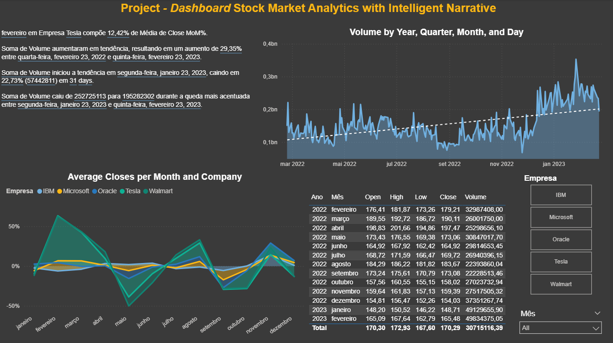

# 📊 Stock Market Analysis Dashboard

An interactive Power BI dashboard analyzing stock performance across major companies (IBM, Microsoft, Oracle, Tesla, Walmart).

---

## 🚀 Project Overview

This project explores stock market data to uncover trends, patterns, and insights using data analytics and AI-driven storytelling.

---

## 📊 Dashboard Preview

---

## 🔍 Key Features

- Analysis of trading volume over time
- Monthly average of Open, High, Low, Close prices
- Month-over-month variation analysis
- Smart Narrative (AI) insights generation

---

## 📈 Key Insights

- Trading volume increased by **29.35%**
- Short-term drop of **22.73%**
- High volatility observed in Tesla stock
- Peak trading period identified in early 2023

---

## 🛠 Tools & Technologies

- Power BI  
- DAX  
- Data Modeling  
- AI (Smart Narrative)

---

## 📂 Dataset

Stock market dataset (2022–2023)

---

## 👨‍💻 Author

Renato Saletti  
Front-End Developer | Data Analyst | AI Enthusiast
